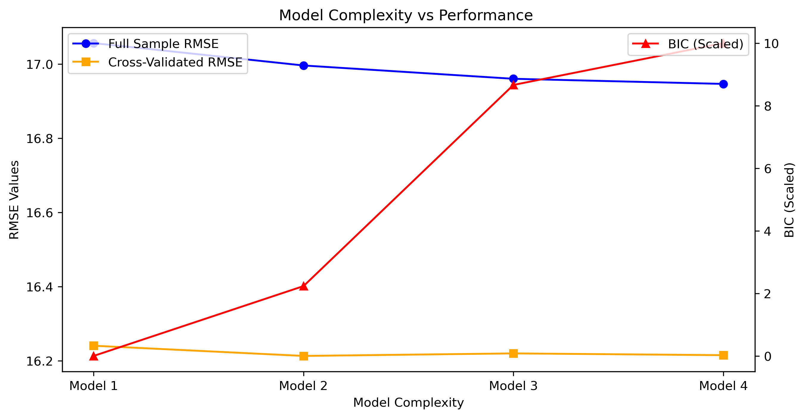

# Regression Analysis of Earnings per Hour

## Introduction

This report presents an analysis of the **CPS-Earnings** dataset, focusing on predicting hourly earnings for individuals working in the **finance sector**.  
This sector was chosen due to its economic significance and the availability of a robust sample size, ensuring statistical reliability.  

The primary objective is to evaluate model performance using **RMSE**, **cross-validated RMSE**, and **BIC** metrics to select the most suitable predictive model.  
The analysis is based on a subset of the dataset, including only individuals employed in finance-related occupations.  

The data was cleaned by filtering individuals aged 16 to 64, ensuring they were actively employed, and removing missing or inconsistent values for key predictors such as hours worked per week, education level, and demographic information.  

Categorical variables, including **sex**, **race**, **marital status**, **union membership**, and **citizenship status**, were converted into dummy variables for inclusion in the regression models.

---

## Model Performance Comparison

The table below summarizes model performance using Root Mean Squared Error (RMSE), cross-validated RMSE, and Bayesian Information Criterion (BIC).

| Model  | RMSE Full Sample | Cross-Validated RMSE | BIC        |
|:-------|-----------------:|---------------------:|-----------:|
| Model 1 | 17.777 | 16.958 | 23315.665 |
| Model 2 | 16.883 | 16.023 | 23042.694 |
| Model 3 | 16.800 | 16.009 | 23083.923 |
| Model 4 | 16.783 | 16.075 | 23104.721 |

**Table 1. Model Performance Comparison**

The graph below illustrates the relationship between model complexity and performance. As expected, RMSE declines with additional predictors, while BIC helps balance fit and complexity.

Increasing model complexity improves prediction accuracy (lower RMSE) but may lead to overfitting, as indicated by changes in BIC.  
**Model 4** includes an interaction term to capture the relationship between non-US-born status and education level, adding nuance to earnings predictions.

---

## Conclusion

The analysis highlights the trade-off between model complexity and predictive performance.  

**Model 1** is the simplest and most interpretable, making it a strong choice when prioritizing explainability. However, its higher RMSE and BIC suggest a limited predictive power.  

**Model 3** achieves the lowest cross-validated RMSE, indicating superior generalization performance. It strikes a balance between including relevant demographic factors and avoiding overfitting.  

**Model 4** incorporates an interaction term for non-US-born individuals with higher education. While this adds nuance, its slight increase in BIC suggests potential overfitting.

---

## Appendix

### Model Specification

We estimate four OLS models:

- **Model 1:**

  $$
  Earnings = \beta_0 + \beta_1 Sex + \beta_2 Age + \beta_3 Education_{low} + \beta_4 Education_{middle} + \beta_5 Education_{high} + \epsilon
  $$

- **Model 2:**

  $$
  Earnings = \beta_0 + \beta_1 Sex + \beta_2 Age + \beta_3 Education_{low} + \beta_4 Education_{middle} + \beta_5 Education_{high} + \beta_6 White + \beta_7 Afram + \beta_8 Asian + \beta_9 Hisp + \epsilon
  $$

- **Model 3:**

  $$
  Earnings = \beta_0 + \beta_1 Sex + \beta_2 Age + \beta_3 Education_{low} + \beta_4 Education_{middle} + \beta_5 Education_{high} + \beta_6 White + \beta_7 Afram + \beta_8 Asian + \beta_9 Hisp + \beta_{10} NonUSborn + \beta_{11} Married + \beta_{12} Divorced + \beta_{13} Widowed + \beta_{14} Union + \epsilon
  $$

- **Model 4:**

  $$
  Earnings = \beta_0 + \beta_1 Sex + \beta_2 Age + \beta_3 Education_{low} + \beta_4 Education_{middle} + \beta_5 Education_{high} + \beta_6 White + \beta_7 Afram + \beta_8 Asian + \beta_9 Hisp + \beta_{10} NonUSborn + \beta_{11} Married + \beta_{12} Divorced + \beta_{13} Widowed + \beta_{14} Union + \beta_{15} NonUS\_Education_{high} + \epsilon
  $$

---

### Regression Results

The table below presents the regression coefficients, standard errors, and p-values for each model.

| Variable | Model 1 | Model 2 | Model 3 | Model 4 |
|:----------|:-------:|:-------:|:-------:|:-------:|
| afram |  | 2.216* | 2.548** | 2.513** |
|  |  | (1.097) | (1.102) | (1.103) |
| age | 0.334*** | 0.334*** | 0.307*** | 0.307*** |
|  | (0.028) | (0.028) | (0.029) | (0.029) |
| asian |  | 7.763*** | 7.895*** | 7.843*** |
|  |  | (1.060) | (1.187) | (1.187) |
| const | 20.588*** | 17.107*** | 17.039*** | 16.984*** |
|  | (1.028) | (0.948) | (0.964) | (0.964) |
| divorced |  |  | -0.591 | -0.486 |
|  |  |  | (3.469) | (3.470) |
| education_high | 13.699*** | 11.891*** | 11.828*** | 11.534*** |
|  | (0.692) | (0.657) | (0.668) | (0.701) |
| education_low | -6.398*** | -6.247*** | -6.305*** | -6.342*** |
|  | (1.192) | (1.191) | (1.192) | (1.192) |
| education_middle | 6.889*** | 5.216*** | 5.211*** | 5.451*** |
|  | (0.637) | (0.610) | (0.612) | (0.636) |
| hisp |  | 1.980 | 1.789 | 1.818 |
|  |  | (1.881) | (1.889) | (1.888) |
| married |  |  | 2.160*** | 2.127*** |
|  |  |  | (0.709) | (0.710) |
| nonUS_education_high |  |  |  | 3.083 |
|  |  |  |  | (2.213) |
| nonUSborn |  |  | -0.906 | -1.684 |
|  |  |  | (1.147) | (1.276) |
| sex | -7.492*** | -7.435*** | -7.360*** | -7.394*** |
|  | (0.667) | (0.667) | (0.669) | (0.669) |
| union |  |  | 1.375 | 1.336 |
|  |  |  | (1.380) | (1.381) |
| white |  | 5.148*** | 4.808*** | 4.811*** |
|  |  | (0.707) | (0.740) | (0.740) |
| widowed |  |  | 1.639 | 1.696 |
|  |  |  | (3.189) | (3.188) |

**Table 2. Regression Coefficients with Standard Errors in Parentheses**

